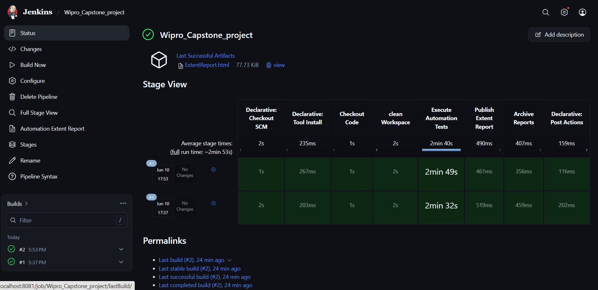
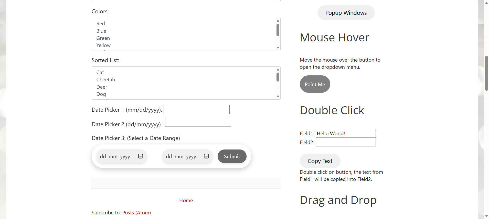
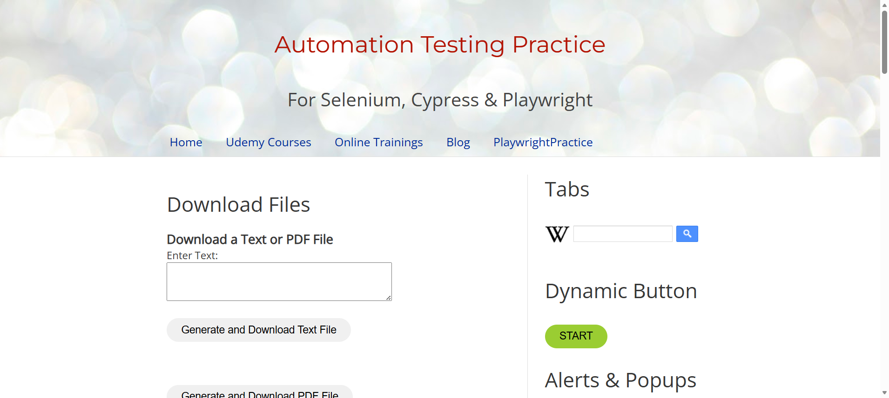
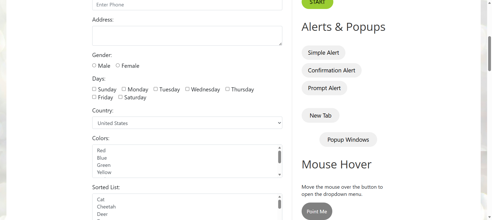
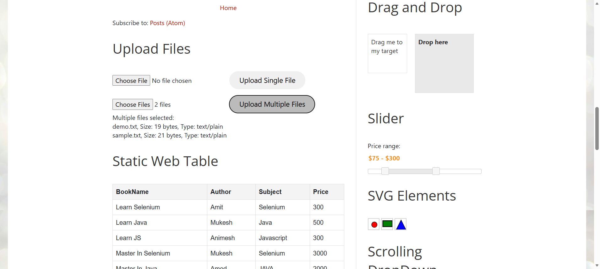

# Selenium Automation Framework

A robust and scalable Selenium Automation Framework built using **Java, Selenium, TestNG, Maven, and Jenkins** following the **Page Object Model (POM)** design pattern.

---

# Features

- Parallel Execution
- Headless Browser Execution
- Jenkins CI/CD Integration
- Extent Reports
- Data-Driven Testing
- Shadow DOM Handling
- SVG Element Handling
- Drag & Drop Automation
- Dynamic Web Tables
- File Upload & Download
- Utility-Based Reusable Framework

---

# Tech Stack

- Java 21
- Selenium WebDriver 4
- TestNG
- Maven
- Jenkins
- Log4j2
- Extent Reports
- Apache POI

---

# Project Structure

```text
TestAutomationBlogspot
│
├── src/test/java
│   ├── base
│   ├── listeners
│   ├── pages
│   ├── tests
│   └── utilities
│
├── src/test/resources
│
├── reports
│
├── screenshots
│
├── testng.xml
│
├── pom.xml
│
└── Jenkinsfile
```

---

# Parallel Execution

```xml
<suite name="Suite"
       parallel="classes"
       thread-count="5">
```

---

# Headless Execution

```properties
headless=true
```

---

# Maven Commands

Run complete test suite:

```bash
mvn clean test
```

Run specific TestNG suite:

```bash
mvn clean test -DsuiteXmlFile=testng.xml
```

---

# Extent Report Location

```text
reports/ExtentReport.html
```

# ScreenShots 
## Jenkins Pipeline


---

## Date Picker Automation


---

## Form Submission


---

## Mouse Hover Action


---

## Multiple File Upload

---

# CI/CD Workflow

```text
 GitHub Push
      ↓
 Jenkins Pipeline
      ↓
 Maven Build
      ↓
 Test Execution
      ↓
 Extent Report Generation
      ↓
 Artifact Archive
```

---

---

# 👨‍💻 Author

## Sagnik Hore

Automation Cocepts Used:

- Selenium WebDriver
- Java Automation Frameworks
- TestNG
- Maven
- Jenkins CI/CD
- API & UI Automation
- Parallel Execution Frameworks

---